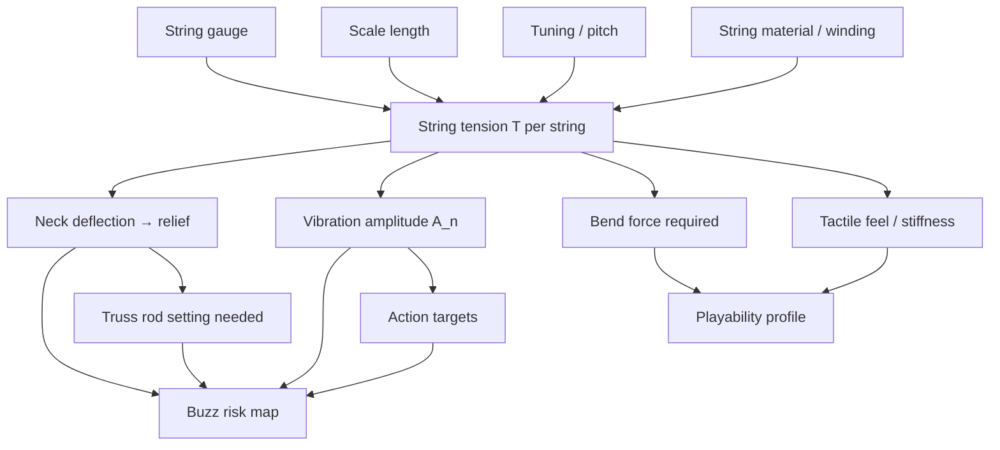
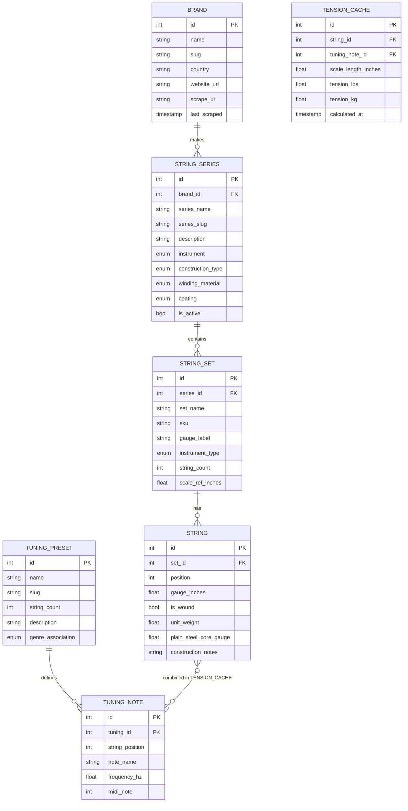
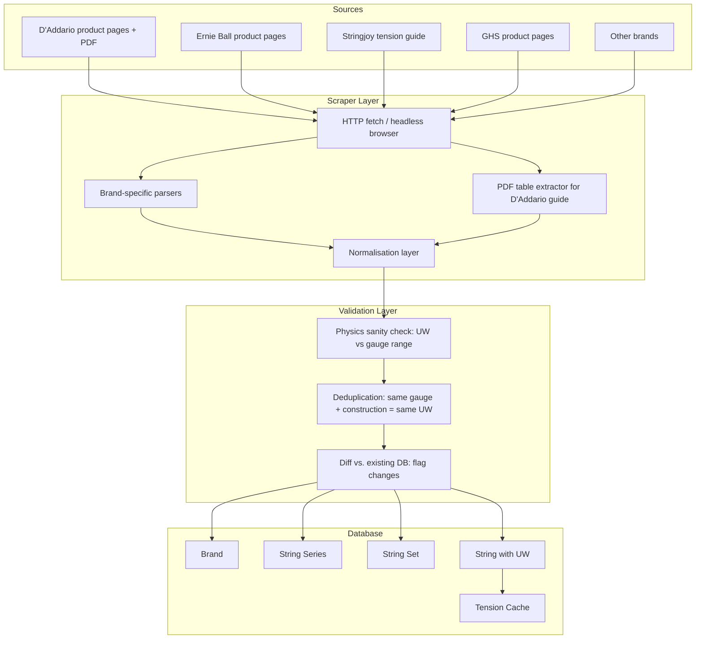
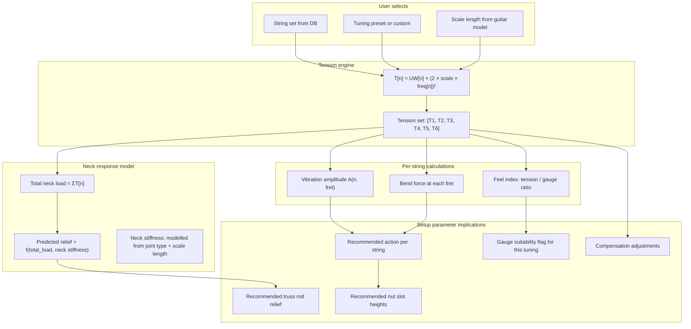
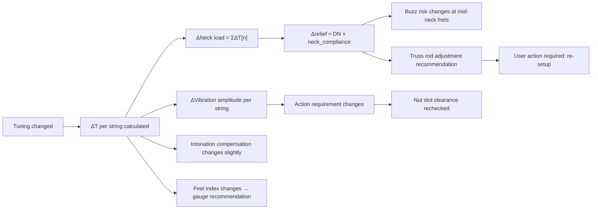
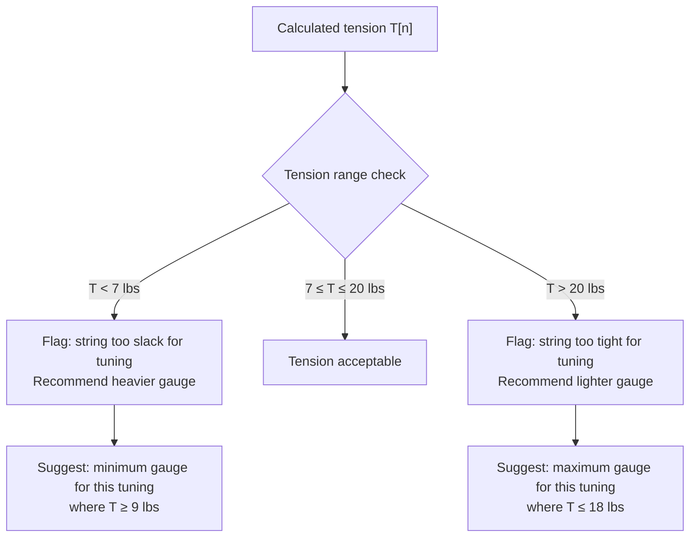
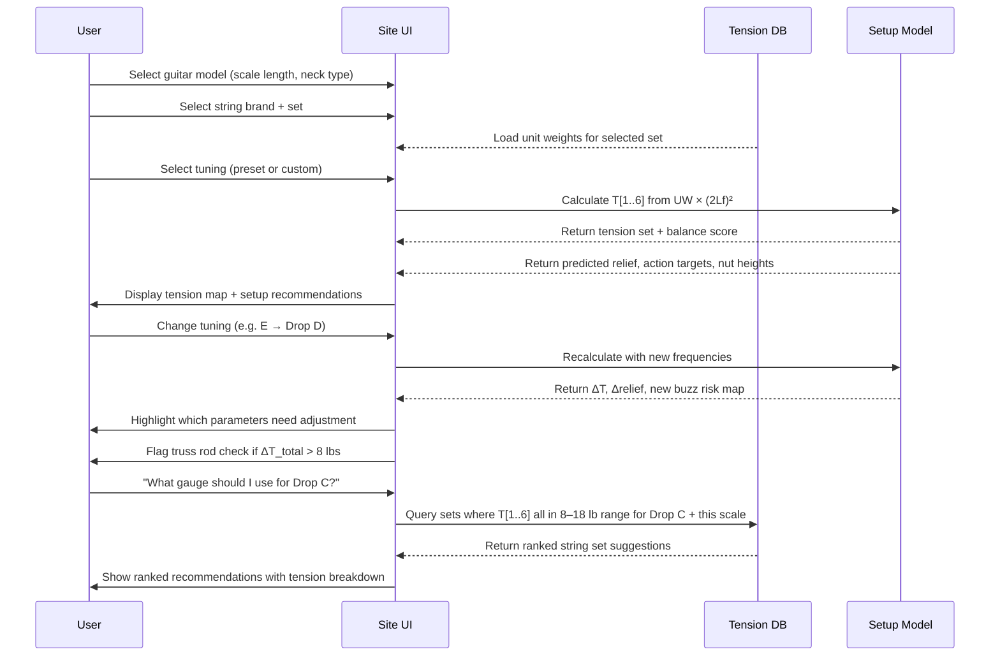

# String Tension Database
## Ideation & Architecture Document

---

## 1. Why Tension Is the Central Variable

String tension is not just one parameter among many — it is the **causal root** of the entire playability chain. Every setup parameter either produces, responds to, or compensates for string tension.



The same string gauge at a different tuning is a fundamentally different setup problem. A `.046` wound string at E standard (~93 Hz) produces roughly 16.7 lbs of tension on a 25.5" scale. Dropped to C (~65 Hz), that same string produces about 8.2 lbs — barely half. The neck responds differently, the vibration amplitude changes, the required relief changes, and the feel changes completely.

Without a tension model, the parameter document can only describe a guitar at a single point. With it, the model becomes dynamic across all tunings.

---

## 2. The Physics — What We Actually Need to Store

String tension follows a clean formula:

```
T = UW × (2 × L × f)²
```

Where:
- `T` = tension in pounds (or kg if using metric unit weight)
- `UW` = unit weight of the string in pounds per inch (lb/in)
- `L` = scale length in inches
- `f` = frequency of the note in Hz

The critical insight is that **unit weight (`UW`) is the only string-specific constant we need to store**. Everything else — tension, scale length, tuning — is calculated from it. Unit weight is determined by the string's construction: gauge, core wire diameter, winding material, winding density. Manufacturers derive it from physics and publish it.

This means the database does not need to store pre-calculated tensions for specific tunings. It stores `UW` per string, then calculates tension for any scale length and any tuning on demand.

### Unit weight by construction type

Different string constructions produce different unit weights for the same gauge:

| Construction | Example | UW vs. plain steel |
|---|---|---|
| Plain steel | `.010` plain | Baseline |
| Nickel-wound roundwound | `.026` nickel | Higher (winding adds mass) |
| Stainless roundwound | `.026` stainless | ~3–5% higher than nickel |
| Pure nickel roundwound | `.026` pure nickel | ~2% lower than nickel-plated |
| Flatwound | `.026` flat | Higher than roundwound (more winding coverage) |
| Half-round / groundwound | `.026` | Between round and flat |
| Coated | `.026` coated | Within ~1% of equivalent uncoated — coating is negligible mass |

> **Key decision:** Store `unit_weight` per individual string gauge + construction type. This is manufacturer-independent — the physics of a `.026` nickel-wound string are the same across brands. Brand differences show up in quality and feel, not meaningfully in tension for equivalent specs.

---

## 3. Database Architecture

### 3.1 Entity Relationship



### 3.2 Key Table Notes

**`STRING`** is the atomic unit. Each row is a single string (e.g., the `.026` wound string in a set of six). It stores:
- `unit_weight` — the physics constant, in lb/in. This is what enables tension calculation for any scale/tuning.
- `plain_steel_core_gauge` — for wound strings, the diameter of the inner core wire. This affects break-over behaviour at the nut and saddle.

**`TENSION_CACHE`** is a materialised calculation, not source data. It is pre-computed for common scale lengths (24.75", 25.5", 26.5") × all tuning presets, and invalidated if unit weight is updated. For custom scale lengths or custom tunings, tension is calculated on-the-fly.

**`TUNING_PRESET`** stores the note and frequency per string position. Frequency is stored as the authoritative value — note names are derived. This makes alternative temperaments or microtonal tunings representable without schema changes.

---

## 4. Tuning Preset Library

### 4.1 Core tuning presets (MVP)

| Slug | Name | Strings (low → high) | Common context |
|---|---|---|---|
| `standard_e` | E Standard | E2 B2 G3 D3 A2 E2 | All genres |
| `drop_d` | Drop D | D2 A2 D3 G3 B3 E4 | Rock, metal |
| `half_step_down` | Eb Standard | Eb2 Bb2 Gb3 Db3 Ab2 Eb2 | Blues, classic rock |
| `full_step_down` | D Standard | D2 A2 F3 C3 G2 D2 | Metal, hard rock |
| `drop_c` | Drop C | C2 G2 C3 F3 A3 D4 | Metal |
| `drop_b` | Drop B | B1 F#2 B2 E3 G#3 C#4 | Heavy metal |
| `open_e` | Open E | E2 B2 E3 G#3 B3 E4 | Slide, blues |
| `open_g` | Open G | D2 G2 D3 G3 B3 D4 | Slide, Rolling Stones style |
| `open_d` | Open D | D2 A2 D3 F#3 A3 D4 | Slide, folk |
| `dadgad` | DADGAD | D2 A2 D3 G3 A3 D4 | Celtic, folk |
| `nsgt` | New Standard (Fripp) | C2 G2 D3 A3 E4 G4 | Progressive |

### 4.2 Custom tuning support

The user can enter any note (or frequency) per string. The model calculates:
- Tension per string at that note
- Whether the gauge is appropriate for that tension (too slack / too tight flags)
- What the resulting relief and action implications are

### 4.3 Tension change from tuning shift

A semitone change in pitch = a factor of `2^(1/12) ≈ 1.0595` in frequency. Since tension scales with `f²`, each semitone changes tension by a factor of `1.0595² ≈ 1.122`. That is:

- **+1 semitone** → tension increases by ~12.2%
- **−1 semitone** → tension decreases by ~10.9%
- **−2 semitones** (full step down) → tension decreases by ~20.6%
- **−3 semitones** (drop from E to C#) → tension decreases by ~29.3%

This is significant. A whole-step-down tuning needs either heavier gauges (to restore tension to the neck's preferred range) or a truss rod adjustment (to compensate for reduced pull).

---

## 5. Scraping Strategy

### 5.1 Target sources

| Brand | Source | Format | Priority |
|---|---|---|---|
| D'Addario | `daddario.com` + published tension guide PDF | Product pages + PDF table | Highest — most comprehensive public data |
| Ernie Ball | `ernieball.com` string product pages | Structured product data | High |
| Elixir | `elixirstrings.com` | Product pages | High |
| GHS | `ghsstrings.com` | Product pages + PDF guides | Medium |
| Stringjoy | `stringjoy.com/tension-guide` | Interactive calculator (published unit weights) | High — Stringjoy publishes raw unit weights openly |
| DR Strings | `drstrings.com` | Product pages | Medium |
| Rotosound | `rotosound.com` | Product pages | Medium |
| Dunlop | `jimdunlop.com` | Product pages | Medium |
| Fender | `fender.com/strings` | Product pages | Low — limited spec data |

### 5.2 What to scrape per string product

```
brand_name
series_name
set_sku
set_gauge_label          (e.g. "Regular Light 10-46")
string_count
individual gauges        (array: [.010, .013, .017, .026, .036, .046])
construction_type        (roundwound / flatwound / halfround)
winding_material         (nickel-plated steel / stainless / pure nickel / bronze)
core_type                (hex / round)
coating                  (none / nanoweb / polyweb / optiweb / other)
unit_weight_per_string   (array, if published — D'Addario and Stringjoy publish this)
tension_at_reference     (array, if published — some brands only publish this, not UW)
reference_scale_inches   (what scale the published tension assumes — usually 25.5")
reference_tuning         (what tuning the published tension assumes — usually E standard)
```

### 5.3 The unit weight inference problem

Many brands publish tension at a reference (25.5", E standard) but not unit weight directly. Unit weight can be back-calculated:

```
UW = T / (2 × L × f)²
```

This is exact — if you have the published tension at known scale and tuning, you can recover the unit weight and then calculate tension at any other scale/tuning. This is how the scraper should handle brands that don't publish UW directly.

### 5.4 Scraping architecture



### 5.5 Scrape frequency

- **Full rescrape:** Monthly (brands update products infrequently)
- **New product detection:** Weekly (check for new SKUs)
- **Physics constants (UW):** These should only change if a brand reformulates a string. Flag any UW change > 2% for manual review — it likely indicates a scraping error rather than a real product change.

### 5.6 Physics sanity bounds

Unit weight is predictable from gauge. A scraper result outside these bounds should be rejected and flagged:

| Gauge range | Plain steel UW range (lb/in) | Wound string UW range (lb/in) |
|---|---|---|
| .008 – .012 | 0.000025 – 0.000060 | N/A (plain only) |
| .013 – .018 | 0.000065 – 0.000130 | N/A (plain only) |
| .017 – .024 | 0.000115 – 0.000230 | 0.000160 – 0.000350 |
| .024 – .036 | — | 0.000350 – 0.000750 |
| .036 – .060 | — | 0.000700 – 0.001500 |

---

## 6. Integration with the Setup Parameter Model

### 6.1 How tension feeds into every setup parameter



### 6.2 The tuning change cascade

When a user changes tuning (e.g. from E Standard to Drop D), the following cascades through every setup parameter:



### 6.3 Tension-to-relief approximation model

The neck does not respond linearly to total tension — its stiffness varies by construction. A working approximation:

```
relief = (total_tension_lbs × neck_compliance) + baseline_relief
```

Where `neck_compliance` is a coefficient derived from neck joint type:
- Bolt-on, maple neck: ~0.0018 mm/lb
- Set-neck, mahogany: ~0.0022 mm/lb
- Neck-through: ~0.0014 mm/lb (stiffer)

Total string tension for a typical 10-46 set in E standard on 25.5" ≈ 101 lbs. This produces roughly 0.18–0.22 mm of relief, which aligns with typical setup specs.

In Drop D, the low E string loses approximately 8.5 lbs of tension. Total load drops to ~92.5 lbs. Predicted relief decreases by ~0.015 mm. This is small but measurable, and at very low action (< 1.5 mm), enough to reduce buzz clearance meaningfully.

> **MVP simplification:** Model this as a linear coefficient with three presets (bolt-on / set / through) rather than trying to compute true neck stiffness from wood properties.

### 6.4 Gauge suitability flagging

Every string has an effective tension range for playability. Below the lower bound, the string feels floppy and intonates poorly. Above the upper bound, it is uncomfortable to play and may place excessive stress on the neck.



Practical thresholds (approximations, vary by player preference):
- **Too slack:** < 7 lbs — string loses clarity, intonation becomes unreliable
- **Comfortable range:** 8–18 lbs per string
- **Too tight:** > 20 lbs — physically demanding, neck stress concern

### 6.5 Tension balance across the set

A well-balanced string set has relatively even tension across all six strings. Significant imbalance makes some strings feel very different from others and affects vibrato technique.

The model should calculate the **tension standard deviation** across the set and flag imbalanced sets:

```
tension_balance_score = std_dev(T[1..6]) / mean(T[1..6])
```

- Score < 0.15: well-balanced
- Score 0.15–0.25: noticeable variation, common in standard sets
- Score > 0.25: significant imbalance — flag and suggest alternatives

This is why some players use custom/balanced-tension sets: Stringjoy and D'Addario NYXL balanced tension sets are specifically engineered to equalise tension across strings for a given tuning.

---

## 7. New Problems Unlocked by Tension Data

The following playability problems from the parameter document can now be diagnosed more precisely:

### T-01 — String feels floppy / lacks definition
**Previously:** Could only say "action issue" or "gauge issue."
**With tension data:** Calculate `T[n]` for the current gauge + tuning + scale. If `T[n] < 7 lbs`, flag gauge as too light for the tuning. Recommend minimum gauge to achieve `T[n] ≥ 9 lbs`.
**Key parameter:** `unit_weight[n]`, `frequency[n]`, `scale_length`

---

### T-02 — Guitar is hard to play in this tuning (stiff strings)
**Previously:** Subjective.
**With tension data:** `T[n] > 18 lbs` on multiple strings. Flag as a heavy-gauge/high-tuning combination. Suggest either lighter gauge or confirm player preference for high tension.
**Key parameter:** `unit_weight[n]`, `frequency[n]`

---

### T-03 — Guitar buzzes after retuning but was fine before
**Previously:** Unexplained.
**With tension data:** Downtuning reduces total neck load → reduced relief → strings sit closer to frets at mid-neck. The truss rod setting that was correct at E standard is now too tight at D standard. Flag `ΔT_total` > 8 lbs as a "truss rod check required" trigger.
**Key parameter:** `ΔT_total`, `neck_compliance`, `relief_bass/treble`

---

### T-04 — Intonation drifts with tuning change
**Previously:** Compensation treated as a fixed value.
**With tension data:** Compensation requirement is not purely a scale length calculation — it is also affected by string stiffness (inharmonicity), which is a function of tension and core diameter. Higher tension = less inharmonicity = less compensation required. Lower tension = more inharmonicity = more compensation needed. 

Inharmonicity coefficient `B`:
```
B ≈ (π³ × d⁴ × E) / (64 × T × L²)
```
Where `d` = core wire diameter, `E` = Young's modulus of steel (~200 GPa), `T` = tension, `L` = scale length. As tension drops (in lower tunings), `B` increases, requiring more compensation — especially noticeable on wound strings.

---

### T-05 — Bends feel inconsistent across the neck
**Previously:** Attributed to relief or fall-off.
**With tension data:** Bend resistance at fret `n` = `2 × T × sin(θ)` where `θ` is the bend angle required to reach target pitch. Tension change from downtuning directly changes bend feel. A lighter-tuned string at the same gauge bends more easily — this is an expectation calibration, not a setup defect. The model can now quantify this explicitly.

---

## 8. User Flow



---

## 9. MVP Scope vs. Full Scope

### MVP (Phase 1)

- **Brands in DB:** D'Addario, Ernie Ball, Elixir (covers ~70% of the market)
- **Tunings:** The 11 presets listed in section 4.1 + custom entry
- **Tension calculation:** Full formula — not approximated
- **Relief model:** Linear approximation with 3 neck compliance presets
- **Gauge suitability:** Simple threshold flags (< 7 lbs, > 20 lbs)
- **Balance score:** Calculated and displayed
- **Inharmonicity:** Not included (too complex for MVP)
- **Cache:** Pre-calculated for 24.75" / 25.5" / 25.625" / 26.5" scale lengths × 11 tunings

### Post-MVP (Phase 2)

- Full brand coverage (GHS, Stringjoy, DR, Rotosound, Dunlop)
- Inharmonicity model for compensation precision
- Temperature/humidity correction (tension changes ≈ 0.1% per °C)
- "Find the right gauge" recommendation engine (given tuning + feel preference → optimal set)
- Per-string custom gauges (mixing sets)
- Baritone and 7-string support

---

## 10. Revised Setup Parameter Document Integration Points

The following additions/changes are needed in the existing parameter document to accommodate the tension database:

| Section | Change |
|---|---|
| §2.4 String Set | Add `string_set_id` FK reference to DB. `unit_weight[1..6]` becomes stored, not user-entered. |
| §2.1 Scale | `scale_bass` and `scale_treble` become the scale length inputs to the tension formula. |
| §2.6 Neck Setup | `relief_bass/treble` gets a "predicted" value calculated from tension + neck compliance, alongside the "actual" measured value. Difference = truss rod adjustment needed. |
| §2.9 Player Profile | Tuning replaces `tuning[1..6]` as a free-text field — it becomes a FK to `TUNING_PRESET` or a `CUSTOM_TUNING` object. |
| New: §2.10 Tension Profile | New section — stores `T[1..6]` at current tuning, balance score, gauge suitability flags per string. This is a computed section, not user-entered. |
| Problems P-01 through P-20 | Each problem diagnosis now includes tension as a contributing variable where relevant (see T-01 through T-05 above). |

---

*Document version 1.0 — string tension database architecture and integration design.*
