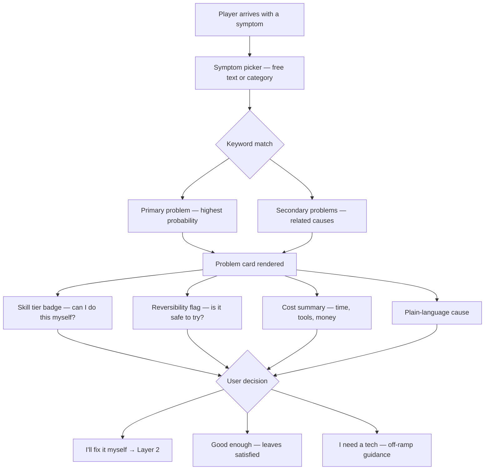
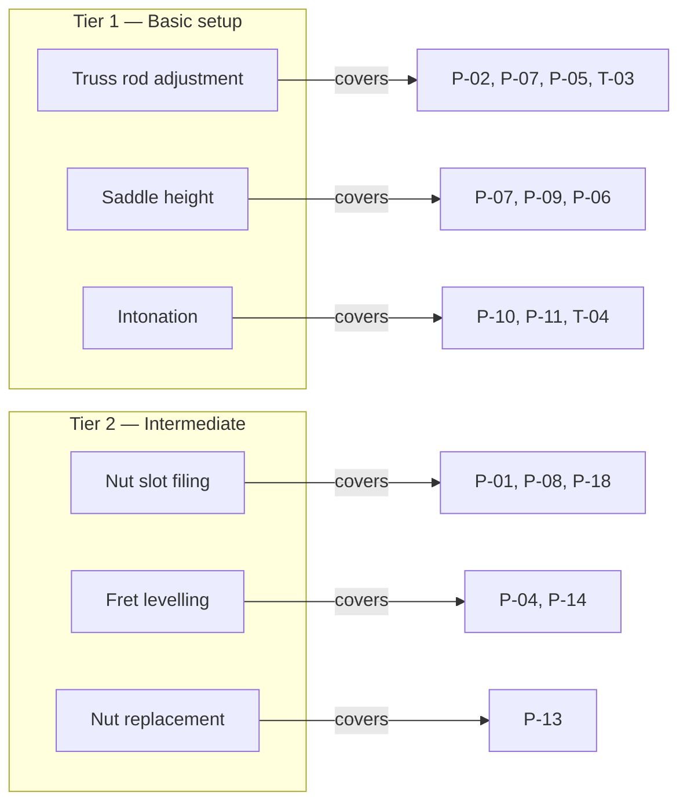
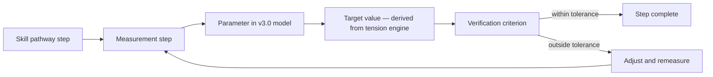
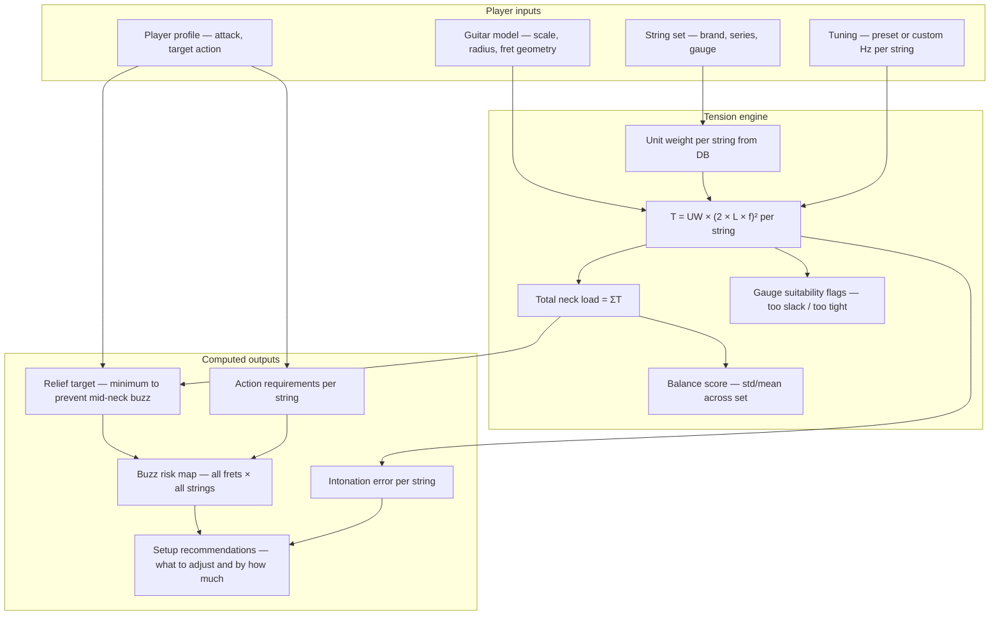
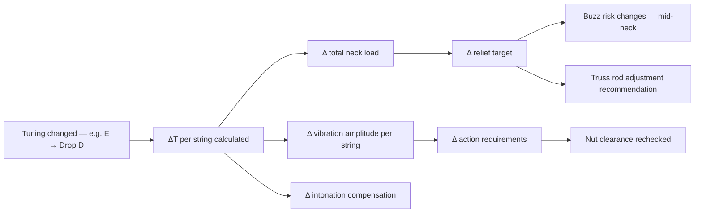
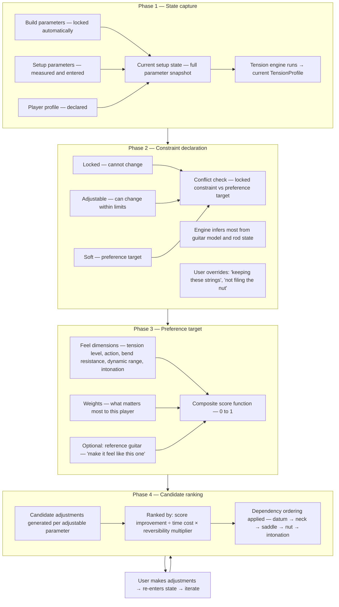
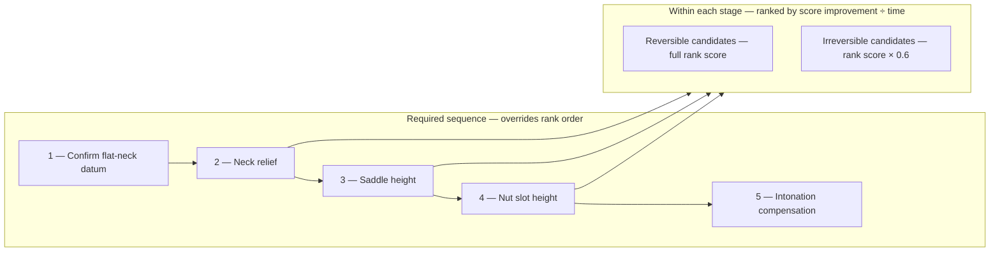
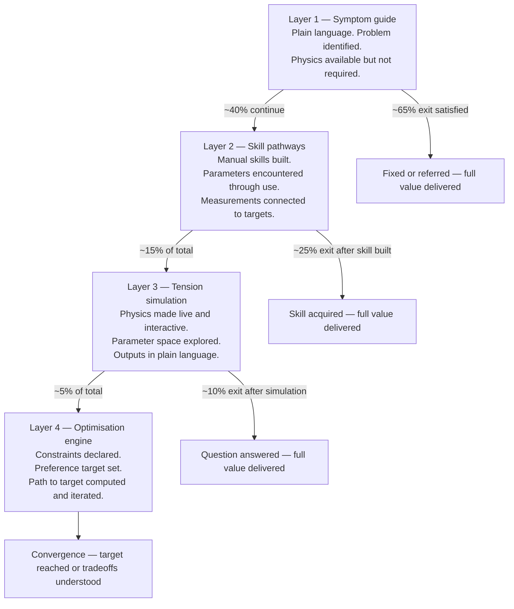

# Feature Layers
## A Reading Guide to the Site's Four Levels of Depth

---

The site is built around one idea: a player should be able to arrive with a problem expressed in their own words and leave with either a fix they understand, a skill they've started to build, or a confident referral to a professional. The four feature layers are the mechanism for that. Each one is a complete destination in itself. Each one also opens a door to the next.

What follows is an exploration of each layer — what it does, who it serves, what it pulls from the underlying model, and how it hands off to the next level.

---

## Layer 1 — The Symptom Guide

### What it is

The symptom guide is the entry surface for everyone. There are no prerequisites, no assumed vocabulary, and no required knowledge about how guitars work. The only question it asks the user is: what are you experiencing?

The core insight behind this layer is that players describe their problems in consistent ways even without technical language. "It buzzes when I play open chords" and "it rattles on the low strings" and "the first few frets feel stiff" are all recognisable patterns that map reliably to specific physical causes. The symptom guide exploits that reliability.

### How it works

The entry point is a symptom picker. Players can either type a free description or choose from a set of plain-language categories:

- It buzzes
- It's hard to play
- It sounds out of tune
- Bending feels wrong
- It feels uneven or inconsistent
- I changed something and now it's worse

That last category is important. It's a direct entry point for the tension-driven problems — the cases where a retuning or string swap has changed how the guitar behaves, and the player doesn't yet understand why. Those are some of the most common real-world arrival scenarios and they're exactly where the physics model adds the most explanatory value.

The symptom picker queries a vocabulary table — a large set of `SymptomEntry` records that map plain-language phrases and keywords to problem IDs from the 26-problem index. The match is fuzzy and the results are ranked by probability. A player who says "my guitar sounds like a sitar" gets P-02 (whole-neck buzz) as the primary hit. A player who says "buzzes when I strum hard" gets P-06 (buzz when playing hard) as primary and P-02 as secondary.



### What a problem card contains

Each problem in the index has a complete record. The card renders the most important information immediately — no scrolling, no expanding required — and holds the detail behind a disclosure that the user opens if they want it.

What's always visible:

- The problem name and plain-language symptom description
- The cause in one or two plain sentences with no technical terms
- A skill tier badge — a five-level rating from t0 (no skill required) to t4 (outside setup scope entirely)
- Whether the fix is reversible or involves material removal you can't undo
- A cost row: estimated time, tool cost, and skill label

What's behind the expand:

- Step-by-step fix procedure
- Tool list with specific tool names
- The off-ramp — the condition under which the user should stop and refer to a professional, with language they can use to describe the problem to a tech
- An optional physics toggle that surfaces the underlying parameter names and formula references without forcing them on anyone

### The skill tier system

The tier system is the answer to the question every player is actually asking: is this mine to do?

| Tier | Label | What it means |
|------|-------|---------------|
| t0 | No skill required | Change a setting or swap strings — immediate, fully reversible, no tools |
| t1 | Basic setup | A measurement and an adjustment — learnable in an afternoon, reversible with care |
| t2 | Intermediate | Involves material removal or fine tolerances — worth learning but requires practice |
| t3 | Advanced | Requires specialist tools or significant experience — better referred |
| t4 | Luthier scope | Outside setup entirely — structural or requires professional equipment |

The tier badge appears before the fix detail. A player sees it before they read anything else about what's involved. This is deliberate: the tier is the triage. It answers the confidence question before the player has invested time reading a procedure they're going to hand to someone else anyway.

Reversibility is a separate flag from tier because they don't always travel together. Truss rod adjustment is t1 but fully reversible. Nut slot filing is also t1 but irreversible downward — once you've removed material, it's gone. A player needs to know both things before they pick up a tool.

### The off-ramp

Every problem that has a referral condition includes an off-ramp record. This is not just a note saying "take it to a tech." It contains:

- The specific condition that triggers the referral — "if the truss rod is already at its limit" or "if the buzz persists after adjusting saddle height"
- Whether the referral is to a setup tech (reversible work) or a luthier (structural)
- Plain language the player can use to describe the problem to a professional — because most players don't know how to describe a setup problem and walking into a guitar shop and saying "it buzzes" is not very useful
- A rough cost indication so the referral feels like an informed choice, not a defeat

The framing matters here. The off-ramp is presented as the right call for this situation, not as a failure to fix it yourself. A player who hands a structural problem to a professional is making the correct decision.

### Who this layer serves and where they exit

The symptom guide is the whole product for roughly 65% of visitors. The frustrated beginner whose guitar buzzes on open chords finds P-01 or P-02, reads a plain-language explanation, learns that they need a feeler gauge and fifteen minutes, and either does it or decides to take it to a shop. Either way, they leave knowing something they didn't when they arrived.

The casual player who changed strings and now the intonation is off finds T-04 or P-10, reads that the saddle compensation needs adjusting when string gauge changes, and understands why for the first time. That understanding — even without a fix — is the first payoff the guide is designed to deliver.

---

## Layer 2 — Skill Pathways

### What it is

Skill pathways are the site's investment in players who want to stop referring the same problem to a tech every time and start owning it themselves. There are six pathways, each covering one learnable skill area, and each one is a complete self-contained progression from "what is this" to "I've done this before and I know what to check."

The pathways exist because of a specific observation: the players who learn to do one setup task themselves almost always go on to learn more. The first time someone adjusts their own truss rod and the buzz disappears, they understand something about the instrument they didn't before. That understanding is motivating in a way that reading about it isn't. The skill pathway structure is designed to reliably produce that first success.

### The six learnable skills



Each pathway maps to a set of problem IDs — the problems that this skill addresses. A player who arrives via P-02 (whole-neck buzz) and goes to the fix detail encounters a link to the truss rod pathway, because truss rod adjustment is the skill that solves P-02 and it's worth learning.

### What a skill pathway contains

The pathway structure is built around learning progression, not just procedure. The distinction matters: a procedure tells you what to do; a pathway tells you what you are learning at each step and why, so that the second and third time you do it you are doing it with understanding rather than following instructions by rote.

Each pathway contains:

**What this skill is** — a plain explanation of the physical thing being adjusted and what it controls. Before a player touches a truss rod, they should understand that it counteracts string tension and that turning it changes the bow of the neck, not something arbitrary.

**When you need it** — the set of conditions that call for this skill. For truss rod adjustment: when there's whole-neck buzz with no high frets, when action is globally high despite correct saddle height, when the guitar has been retuned significantly and the neck geometry has shifted.

**Before you start** — the prerequisites. What measurements to take first. What to confirm about the current state. For truss rod work: confirm flat-neck datum exists, confirm relief measurement, confirm rod state isn't at limit before applying force.

**Practice advice** — what to practise on first and how to build confidence. For nut filing: practise on a cheap bone blank before touching the nut on the instrument. For truss rod: make small adjustments (eighth turns), wait for settling, measure before proceeding.

**Step progression** — the learning stages in order, each with a success criterion. Not "tighten the rod" but "apply a quarter turn clockwise, then wait fifteen minutes and remeasure — success is a relief reading within 0.05 mm of your target."

**Common mistakes** — what goes wrong, why it goes wrong, and whether it's recoverable. This section is the one that converts fear of irreversibility into informed caution. A player who knows that over-tightening the truss rod shows up as a high reading at the 12th fret, not an immediate problem, is equipped to catch a mistake before it becomes serious.

### What the physics model contributes to pathways

The skill pathways connect directly to the parameter model. Every step that involves measurement references a specific parameter from `guitar_setup_parameters_v3.md` — `relief_bass`, `nut_slot_height[n]`, `saddle_height[1..6]`. The pathway doesn't expose those parameter names to the user by default, but it uses the same target values and the same diagnostic logic.

This means a player who completes the truss rod pathway has, whether they know it or not, learned to measure and set `relief_bass` and `relief_treble` to within the values the physics model considers correct for their string set and tuning. When they later encounter the simulation tool, those parameters are familiar — they've been working with them by hand.



### Who this layer serves and where they exit

The DIY tech archetype lives here. They arrive with a specific problem, learn the underlying skill, and come back the next time they need it — and the time after that. Over several visits, they work through multiple pathways and build a complete setup vocabulary.

The tone chaser also passes through this layer but often doesn't stay. They care more about the downstream effects — how gauge and tuning interact — than in developing the manual skills. They pick up enough from the skill pathways to understand the cause of what they're experiencing, and then they move toward the simulation.

Roughly 40% of visitors engage with Layer 2 in some form. About half of those leave after completing or reading through one pathway. The other half are ready for something more systematic.

---

## Layer 3 — Tension Simulation

### What it is

The tension simulation is where the physics model becomes a live tool rather than a reference. A player enters their guitar's configuration — or selects it from a model library — specifies their string set and tuning, describes their playing style, and the tension engine runs across all six strings and produces a complete picture of what their setup should look like and where it currently falls short.

This is the layer that makes the string tension database, the parameter model, and the 26-problem index work together in real time rather than as a collection of reference information. The outputs are all derived from first principles — nothing is pre-baked for a specific guitar configuration. The model computes for whatever combination of scale length, gauge, and tuning the player describes.

### What the player enters

The simulation needs three categories of input:

**Guitar configuration** — loaded from a model preset or entered manually. This populates the build parameters: scale length (bass and treble side), fretboard radius at nut and heel, fret crown height, headstock angle, fret count. These are the fixed constraints the rest of the model runs within.

**String set and tuning** — selected from the string tension database. The player picks a brand, series, and gauge set. The database provides the unit weight per string, which is the physics constant that makes tension calculation possible for any scale and tuning. The player then selects a tuning preset (or enters custom note frequencies), and the tension engine runs.

**Player profile** — three fields that calibrate the model's output to the actual player. Attack intensity (light, medium, or heavy) multiplies the vibration amplitude and therefore the minimum required clearances. Target action at bass and treble sets the preference the model optimises toward. Genre profile provides a shortcut that populates sensible defaults for all three.



### What the outputs mean

The tension simulation produces five categories of output, all derived from the same physics:

**Per-string tension** — the raw tension in pounds for each string at the current scale and tuning. The display shows these as a bar chart with suitability flags. A string below roughly 7 lbs is flagged as too slack — it will feel floppy, have unpredictable intonation, and be hard to play in tune. A string above roughly 20 lbs is flagged as too tight — it puts excessive load on the neck and makes bending difficult. Most standard gauge sets in E standard land comfortably within this range. Drop tunings and lighter gauges often don't.

**Tension balance score** — the standard deviation divided by the mean across all six strings, expressed as a ratio. A perfectly balanced set (equal tension on every string) scores 0. Most factory sets score between 0.10 and 0.20. Above 0.25 is a warning: the strings pull with meaningfully different force, which the player experiences as uneven feel — some strings feel tight and stiff, others floppy and imprecise. This is the model behind P-16 (uneven feel across strings).

**Relief target** — the minimum neck bow needed to clear the vibration envelope of the strings at the player's attack intensity. This is computed from the physics of the string, not from a rule of thumb. At heavy attack with a low-tuned set on a long scale guitar, the required relief is measurably larger than at light attack with standard gauges. The model produces a specific target in millimetres, not a range.

**Buzz risk map** — a grid of all frets × all strings, each cell coloured by buzz risk. This is the most visually useful output because it immediately shows the character of the problem if one exists. Whole-neck buzz (P-02) appears as a wide band across all strings in the mid-neck area. High-fret buzz (P-04) appears only in the upper register. Wound-string buzz (P-05) appears only on the lower strings. The map makes the problem pattern recognisable at a glance.

**Setup recommendations** — the adjustments needed to bring the current state to the model's targets, expressed in order of operation: datum confirmation first, then neck, then saddle, then nut, then intonation. Each recommendation references the specific parameter being adjusted and the target value.

### The tuning change cascade

One of the most practically useful things the simulation demonstrates is what happens when a player changes tuning. This is where the tension model earns its depth. Dropping from E standard to Drop D is not just a pitch change — it changes the tension on the low string by roughly 20%, which changes the total neck load, which changes the required relief, which changes the minimum action heights at every fret, which changes the risk of buzz across the whole neck.



The simulation makes this cascade visible and quantitative. A player who drops to D standard and then wonders why their guitar suddenly buzzes can run the simulation in both tunings side by side and see exactly where the clearance margin has been consumed. The model also flags whether the change is large enough to have moved the neck since the flat-neck datum was last confirmed — if so, it prompts re-establishing the datum before any adjustments are made.

### What the simulation does not do

The simulation describes a guitar's optimal state for a given configuration. It does not plan a path from the current state to that optimal state, it does not hold constraints fixed while varying others, and it does not compare setups against a target feel. Those are Layer 4's job.

A player who uses the simulation as a reference tool — entering different gauges and tunings to understand what changes — gets substantial value here. A player who wants to ask "this guitar has these constraints, I want it to feel like that guitar, what do I change and in what order" has exhausted what the simulation offers and is ready for the optimisation engine.

### Who this layer serves and where they exit

The tone chaser spends the most time here. They use the simulation to explore gauge and tuning combinations speculatively — "if I go to 11s in Drop C, what happens to the relief target and the feel on the top strings?" The simulation answers that question in seconds instead of the hours of trial and error it would take physically.

The DIY tech uses the simulation as a verification tool — entering their current measured state after a setup to confirm the model agrees, or running it before a setup to know what targets to aim for before picking up a feeler gauge.

About 15% of all visitors reach this layer. Most of them get what they came for and leave. The 5% who continue are the ones who arrive with a question the simulation can quantify but not answer: why does this guitar feel the way it does, and can I close the gap between it and the instrument in their head?

---

## Layer 4 — The Optimisation Engine

### What it is

The optimisation engine is the most technically demanding feature and the one that directly serves the question that motivated the entire modelling effort: "I know what I like. I know what I have. What is the shortest path between them, with the constraints I can't change?"

It is built on the same physics as the simulation but adds three things the simulation lacks: a constraint declaration model, a preference target, and a delta-ranking algorithm that turns the parameter space into a navigable sequence of adjustments ordered by impact per unit of effort.

This is not a diagnostic tool. It assumes the player already understands the parameters and the physics, at least in working terms. Its job is to collapse the trial-and-error space.

### The three-part structure



### Constraints: what can and cannot change

The constraint model is the formal encoding of the player's actual situation. Every parameter in the system is tagged as one of three types:

**Locked** — cannot change. Build parameters (scale length, fretboard radius, fret geometry) are always locked — they are the physical reality of the instrument. Players can also declare setup parameters as locked by choice: "I'm keeping these strings," "I'm not filing the nut," "this tuning is non-negotiable." Locked parameters define the walls of the solution space.

**Adjustable** — can change within declared limits. Setup parameters (relief, saddle height, compensation) are adjustable by default, within the physical range permitted by the instrument's current condition. The rod state from the parameter model is read automatically and used to bound the adjustable range for relief — if the rod is near its limit, the engine cannot recommend a relief increase beyond what the rod can provide.

**Soft** — a preference target. Player profile inputs (target action, attack intensity) become soft constraints in the optimisation layer. They define what the engine is optimising toward rather than a hard bound.

The engine runs a conflict check before generating any candidates. If a player has locked their string set but their preference target requires a different tension level, the engine surfaces that conflict explicitly: "your target tension level is not achievable with this string set locked — either change the string set constraint or adjust the preference target." It does not silently work around contradictions.

### The preference target: from feel words to computable dimensions

The most novel part of the optimisation engine is the preference model. It translates what a player actually says about how they want the guitar to feel into dimensions the physics model can evaluate.

Five feel dimensions are used:

| Dimension | Computed from | What the player is describing |
|-----------|--------------|-------------------------------|
| Tension level | Mean tension across all strings | How much the strings resist the player — overall heft |
| Tension balance | Standard deviation / mean | Whether all strings feel consistent or some feel tight and others floppy |
| Action feel | Target action at 12th fret, combined with attack multiplier | How far the strings sit from the frets — ease of fretting |
| Bend resistance | Tension × scale at a reference fret and bend angle | How hard it is to push a string off-pitch |
| Dynamic range | Gap between clean threshold and buzz threshold at each fret | Whether the guitar feels different at different dynamics |

Each dimension is scored from 0 to 1 against the player's stated target. The composite score is a weighted sum, with the weights reflecting what the player says matters most. A player who cares primarily about feel under heavy picking sets a high weight on tension and bend resistance. A player who plays fingerstyle and wants low action sets a high weight on action and dynamic range.

The reference guitar shortcut takes this further. If a player has a saved setup state for a guitar they love — entered as part of a previous simulation session — the engine extracts the feel dimension values from that state's tension profile and sets them as the preference target automatically. The gap between the current guitar and the reference guitar becomes the optimisation objective. This is the formal implementation of "make this guitar feel like that one."

### The ranking algorithm

For every adjustable parameter, the engine generates a set of candidate adjustments by stepping through the parameter's range. For each candidate value it clones the current state, applies the change, reruns the tension engine, scores the result against the preference target, and records the score improvement.

Candidates are ranked by:

```
rank score = (score improvement ÷ estimated time in minutes) × reversibility multiplier
```

The reversibility multiplier is 1.0 for reversible changes and 0.6 for irreversible ones — irreversible changes are available to the player but ranked lower than equivalent reversible changes. Nut slot filing is always presented later in the sequence than saddle height adjustment even if the score improvement is similar, because the saddle is recoverable and the nut is not.

The dependency ordering is applied after ranking and overrides it where necessary. The flat-neck datum is always first if it hasn't been confirmed. Neck geometry before saddle. Saddle before nut. Intonation last. This mirrors the physical workflow a technician would follow, and it ensures the engine never recommends setting a saddle height before the neck is stable.



### Iteration

The optimisation engine is not a one-shot tool. The expected workflow is a cycle: declare the state, review the ranked candidates, make the highest-impact adjustments physically, return and re-enter the new measured state, review the updated candidates, repeat.

Each iteration the engine re-scores and re-ranks based on the new state. As the setup converges toward the preference target, the score improvements of the remaining candidates shrink. The engine detects convergence when the top candidate produces less than 2% improvement, or when all remaining candidates with meaningful improvement require irreversible work the player hasn't opted into, or when the composite score exceeds 90%.

At convergence the engine reports one of three things: the target has been reached, the remaining gains require irreversible work (with an explicit confirmation gate), or the target is not achievable within the current locked constraints and the player needs to decide whether to change one of them.

### Multi-tuning optimisation

For players who use multiple tunings on one instrument — which is common and physically non-trivial — the engine can optimise across all declared tunings simultaneously. Each candidate setup state is scored against the preference target for every tuning, and the composite score is the weighted average with the primary tuning weighted highest.

When a candidate adjustment improves the score in one tuning but degrades it in another, the engine surfaces this explicitly rather than averaging it silently. The player sees: "this saddle height change improves your Drop C setup by 8% but reduces your E standard score by 3%." They can choose whether that tradeoff is acceptable.

The engine identifies the Pareto-optimal setup — the state where no single adjustment simultaneously improves all tunings — and presents it as the achievable multi-tuning optimum. This is the formal answer to the question that motivated the whole feature: given this guitar, these constraints, and these tunings, this is as close as physics allows.

### Who this layer serves

The obsessive optimiser is the primary user. They arrive already knowing what they want — a feel they've experienced on another instrument, or an abstract target they've built up through years of playing. The optimisation engine gives them a methodology for pursuing it systematically instead of through accumulated trial and error.

This is also the layer that validates the entire modelling effort. If the physics model is correct — if the tension formula, the relief derivation, the buzz risk calculation, the intonation model all hold — then the optimisation engine should be able to identify, in advance, which adjustments will produce a meaningful change in feel and which won't. A player who follows the engine's recommended sequence and reaches their preference target without the false starts they would have taken manually is the test case for everything built in the five companion documents.

The 5% figure for this layer is approximate but deliberately conservative. The barrier is not complexity — the interface is designed to make the constraint declaration and preference setting as accessible as the symptom picker. The barrier is that the optimisation engine is only useful to a player who has already spent enough time with their instrument to have a specific target in mind. That is a genuine minority, and the rest of the site exists precisely to bring players to the point where they might become that minority.

---

## How the layers connect

Each layer is built to be a complete destination, but the value of the architecture is in the connections between them. A player who enters via the symptom guide and encounters the tension model's explanation for why downtuning causes buzz has been introduced, without knowing it, to the same physics the simulation uses. When they later enter a string set and tuning into the simulation, the output isn't surprising — it's a precise version of something they already understood.



The layered structure means that a player who only ever uses Layer 1 has not missed the rest of the site. They have received exactly what they needed. The layers above them are not withholding value — they are offering a different kind of value that requires more from the player to use. The site works at every level of engagement, and the depth of the model is only visible to the players who are equipped and motivated to use it.

---

*Document version 1.0*
*Companion documents: `setup_guide_architecture.md` · `guitar_setup_parameters_v3.md` · `string_tension_database.md` · `setup_optimisation_engine.md`*
