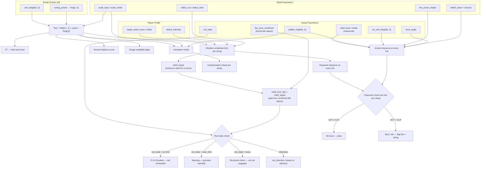
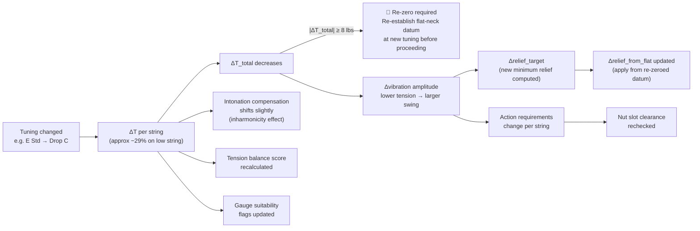
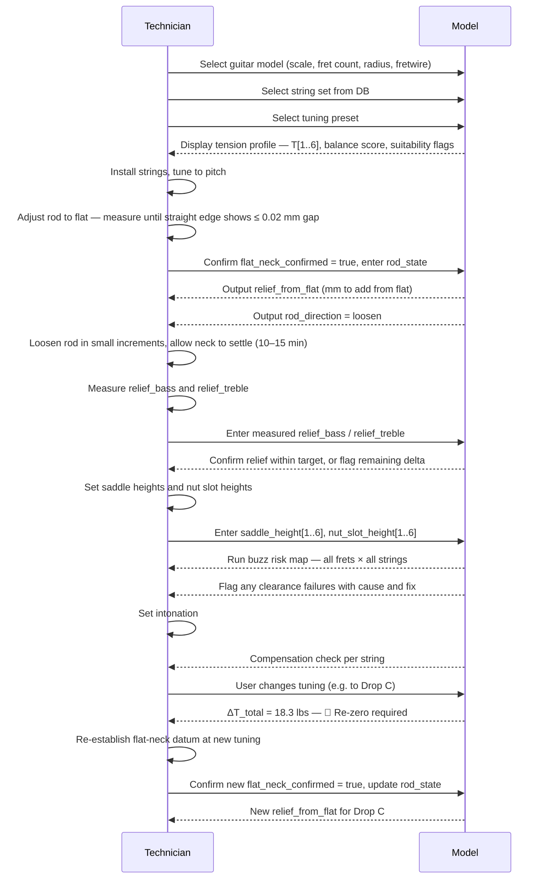
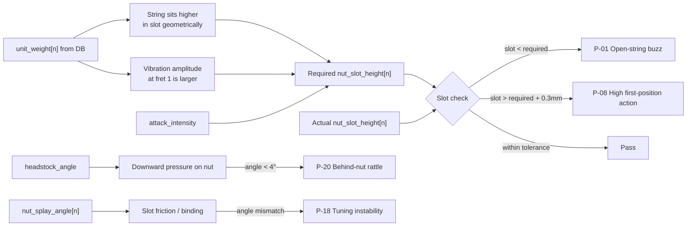
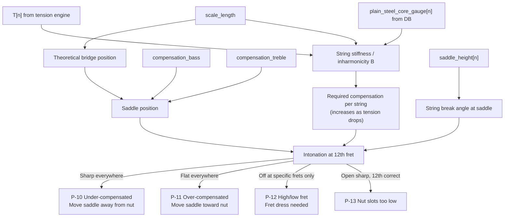
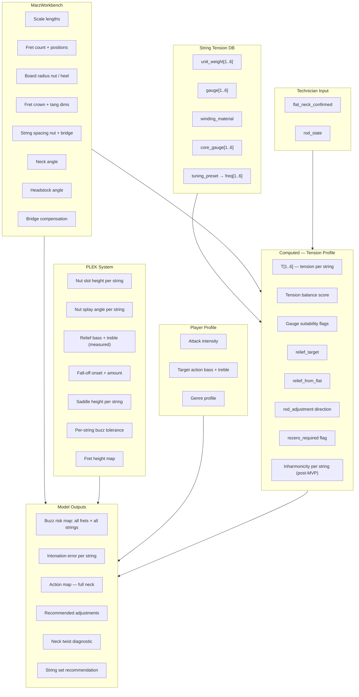
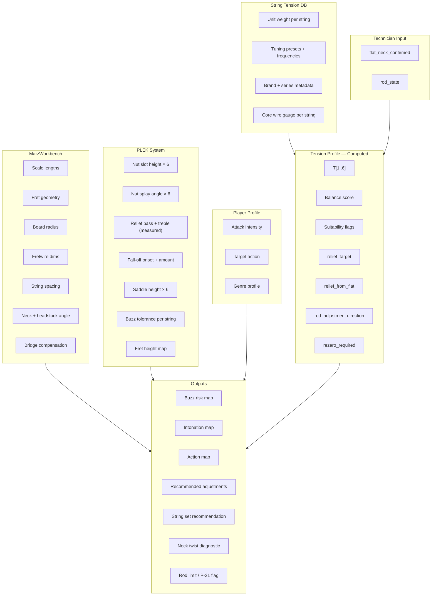
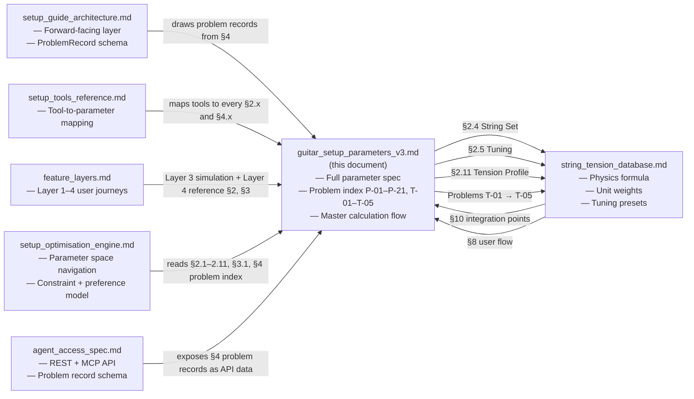

# Guitar Setup Parameter Model
## Electric Guitar — MVP Parameter Specification

**Version:** 3.1
**Companion documents:** [`string_tension_database.md`](./string_tension_database.md) · [`setup_guide_architecture.md`](./setup_guide_architecture.md) · [`setup_tools_reference.md`](./setup_tools_reference.md) · [`feature_layers.md`](./feature_layers.md) · [`setup_optimisation_engine.md`](./setup_optimisation_engine.md) · [`agent_access_spec.md`](./agent_access_spec.md)

---

## Changelog: v3.0 → v3.1

| Section | Change |
|---|---|
| Header | Version bumped to 3.1; companion document list expanded to all six sibling documents. |
| §7 Document Relationships | Graph and cross-reference table extended to cover `setup_guide_architecture.md`, `feature_layers.md`, `setup_optimisation_engine.md`, and `agent_access_spec.md`. The note about `string_tension_database.md §6.3` is resolved — that section has been deprecated in `string_tension_database.md v1.1`. |

---

## Changelog: v2.0 → v3.0

| Section | Change |
|---|---|
| §2.7 Neck Setup | Removed `relief_predicted`, `neck_compliance`. Added `flat_neck_confirmed`, `relief_from_flat`, `rod_state`. The flat neck under full string tension is now the setup datum — neck stiffness is no longer modelled from construction variables. |
| §2.11 Tension Profile | Removed `relief_predicted` and `truss_rod_flag` (both depended on the discarded compliance model). Added `relief_target` and `rod_adjustment` as the replacement outputs. |
| §3.1 Master Calculation Flow | Redrawn to reflect datum-based relief workflow. `neck_compliance` node removed. |
| §3.2 Tuning Change Cascade | Updated — tuning change now triggers a re-zeroing prompt rather than a compliance-derived prediction. |
| §4.2 Problem P-02 | Updated diagnostic to reference flat-neck datum. |
| §4.6 Problem T-03 | Updated — retuning triggers re-zero prompt, not a predicted relief comparison. |
| §4.7 Problem P-21 (new) | Truss rod at or near limit — structural escalation diagnostic. |
| §5 Parameter Completeness | Updated to remove compliance variables, add datum variables. |
| §6 MVP Parameter Set | Updated computed parameter table. |

---

## 1. Overview

This document defines the complete parameter set for the electric guitar setup model. Parameters are derived from four sources:

| Source | Role |
|---|---|
| **MarzWorkbench** | Physical geometry of the instrument (build parameters) |
| **PLEK system** | Precision measurement model, per-string differentiation |
| **Acoustic physics** | String vibration amplitude and clearance calculation |
| **String Tension DB** | Unit weight per string, tuning presets, tension calculation engine |

The String Tension Database is not a fifth parameter group — it is the **calculation engine** that makes the rest of the model dynamic. Without it, every parameter in this document describes a guitar at a single fixed point (one string set, one tuning). With it, the model recomputes across any combination of string brand, gauge, and tuning on demand.

> **For the designer:** Parameters are grouped into three types that map directly to UI concerns:
> - **Build** — read-only inputs, usually selected from a guitar model preset. The player doesn't adjust these.
> - **Setup** — the adjustable dials a technician turns. These are the parameters the site helps optimise.
> - **Player Profile** — preference inputs that personalise the recommendations. This is the onboarding questionnaire.

---

## 2. Parameter Groups

### 2.1 Scale & Fret Geometry
> **Source:** MarzWorkbench | **Type:** Build | **UI:** Guitar model selector

| Parameter | Unit | Description | Typical Range |
|---|---|---|---|
| `scale_bass` | mm | Vibrating string length, bass side | 628–660 mm |
| `scale_treble` | mm | Vibrating string length, treble side | 628–660 mm |
| `fret_count` | integer | Total number of frets | 21–24 |
| `perpendicular_fret` | integer | Fret perpendicular to centreline (multiscale only) | 7–9 |

> **Derived:** Fret position `n` from nut = `scale × (1 − 2^(−n/12))`. For multiscale, position is interpolated between bass and treble scale lengths per string.

> **Tension link:** `scale_bass` and `scale_treble` are direct inputs to the tension formula `T = UW × (2 × L × f)²`. A longer scale at the same gauge and tuning produces higher tension. See [`string_tension_database.md §2`](./string_tension_database.md#2-the-physics--what-we-actually-need-to-store).

---

### 2.2 Fretboard Geometry
> **Source:** MarzWorkbench | **Type:** Build | **UI:** Guitar model selector

| Parameter | Unit | Description | Typical Range |
|---|---|---|---|
| `radius_nut` | mm | Fretboard radius at nut position | 184–305 mm |
| `radius_heel` | mm | Fretboard radius at heel — compound end | 305–406 mm |
| `board_thickness` | mm | Fretboard thickness at nut | 5–9 mm |
| `side_margin` | mm | Fretboard overhang beyond outer strings | 2–4 mm |
| `end_margin` | mm | Fretboard extension beyond last fret | 3–6 mm |

> **Note:** Radius interpolates linearly from `radius_nut` to `radius_heel` across fret positions, giving the per-fret cross-sectional arc the strings must clear. This arc changes clearance requirements for the outer strings differently than the centre strings.

---

### 2.3 Fretwire Geometry
> **Source:** MarzWorkbench | **Type:** Build | **UI:** Guitar model selector (advanced)

| Parameter | Unit | Description | Typical Values |
|---|---|---|---|
| `fret_crown_height` | mm | Height of fret crown above board surface | 0.8–1.5 mm |
| `fret_crown_width` | mm | Width of fret crown | 1.5–3.0 mm |
| `fret_tang_depth` | mm | Depth of fret tang into board slot | 1.2–1.6 mm |
| `fret_tang_width` | mm | Width of fret slot | 0.45–0.60 mm |

> **Critical interaction:** `fret_crown_height` is the absolute reference surface from which all string clearances are measured — not the fretboard surface itself. Every buzz calculation in Section 3 is relative to this value.

> **For the designer:** Fretwire dimensions rarely need to be user-editable on the front end. They are best handled as a preset selection (e.g. "Vintage narrow / Medium jumbo / Stainless jumbo") that maps to stored values behind the scenes.

---

### 2.4 String Set
> **Source:** String Tension DB + MarzWorkbench | **Type:** Player Profile | **UI:** String selector with brand/gauge browser

String data is selected from the String Tension Database, which provides all physical constants needed for calculation.

| Parameter | Unit | Description | Source |
|---|---|---|---|
| `string_set_id` | FK | Reference to a specific set in the String Tension DB | DB lookup |
| `unit_weight[1..6]` | lb/in | Linear mass density per string — the tension physics constant | Loaded from DB |
| `gauge[1..6]` | inches | Physical diameter per string — for display and nut slot calculation | Loaded from DB |
| `winding_material` | enum | `nickel_wound`, `stainless`, `pure_nickel`, `flatwound`, `coated` | Loaded from DB |
| `core_type` | enum | `hex`, `round` — affects stiffness and inharmonicity | Loaded from DB |
| `plain_steel_core_gauge[4..6]` | inches | Core wire diameter for wound strings — affects break-angle behaviour at nut and saddle | Loaded from DB |

> **Tension formula:** `T[n] = unit_weight[n] × (2 × scale_length_inches × frequency_hz[n])²`
> This is calculated live — not stored — for whatever tuning and scale length is currently active.

> **For the designer:** The string selector is a key UI surface. Consider: brand filter → series filter → gauge set selection → individual string display with live tension readout per string as tuning changes.

---

### 2.5 Tuning
> **Source:** String Tension DB | **Type:** Player Profile | **UI:** Tuning selector with custom option

Tuning is a first-class entity because it is the primary variable that causes the entire setup model to recompute — and because a tuning change large enough to shift total string tension by ≥ 8 lbs will require the technician to re-zero the neck.

| Parameter | Unit | Description | Source |
|---|---|---|---|
| `tuning_preset_id` | FK | Reference to a tuning preset (e.g. Drop D, Open G) | DB lookup |
| `custom_tuning[1..6]` | Hz | Per-string frequency for non-preset tunings | User entry |
| `tuning_note[1..6]` | string | Display name (e.g. E4, D2) | Derived from Hz |

**Preset tuning library (MVP):**

| Slug | Name | Strings low → high | Common use |
|---|---|---|---|
| `standard_e` | E Standard | E2 A2 D3 G3 B3 E4 | Universal |
| `drop_d` | Drop D | D2 A2 D3 G3 B3 E4 | Rock, metal |
| `half_step_down` | Eb Standard | Eb2 Ab2 Db3 Gb3 Bb3 Eb4 | Blues, classic rock |
| `full_step_down` | D Standard | D2 G2 C3 F3 A3 D4 | Metal |
| `drop_c` | Drop C | C2 G2 C3 F3 A3 D4 | Metal |
| `drop_b` | Drop B | B1 F#2 B2 E3 G#3 C#4 | Heavy metal |
| `open_e` | Open E | E2 B2 E3 G#3 B3 E4 | Slide, blues |
| `open_g` | Open G | D2 G2 D3 G3 B3 D4 | Slide |
| `open_d` | Open D | D2 A2 D3 F#3 A3 D4 | Slide, folk |
| `dadgad` | DADGAD | D2 A2 D3 G3 A3 D4 | Celtic, folk |

> **Tension change per semitone:** Each semitone shift changes tension by a factor of `2^(2/12) ≈ 1.122`. Dropping one whole step (two semitones) reduces tension by ~20.6% per string. A change in total string tension of ≥ 8 lbs is large enough to alter how the neck sits — the flat-neck datum must be re-established before completing the setup. See §2.7 and [T-03](#t-03--guitar-buzzes-after-retuning-but-was-fine-before).

> **For the designer:** The tuning selector should trigger a live recalculation and visually update the tension readout, the buzz risk map, and any flagged setup warnings — without requiring the user to manually refresh anything. If `|ΔT_total| ≥ 8 lbs`, surface a prominent prompt: *"Tuning change is large enough to affect neck geometry. Re-zero the neck before continuing."*

---

### 2.6 Nut
> **Source:** MarzWorkbench + PLEK additions | **Type:** Setup | **UI:** Setup parameters panel

| Parameter | Unit | Description | Notes |
|---|---|---|---|
| `nut_slot_height[1..6]` | mm | String path height at nut, above fret-1 crown | Per string — PLEK addition |
| `nut_string_spacing` | mm | Outer string to outer string at nut | Typically 34–36 mm |
| `nut_thickness` | mm | Physical thickness of nut block | 5–6 mm |
| `nut_splay_angle[1..6]` | degrees | String slot angle toward each tuner | Per string — PLEK addition |
| `nut_offset` | mm | Distance from fret 0 to nut face | 0–2 mm |

> **Tension link:** The required `nut_slot_height[n]` is partially determined by string gauge — a thicker string sits higher in its slot geometrically, and also vibrates with greater amplitude. Both are functions of `unit_weight[n]` from the DB. When the string set changes, nut slot height recommendations update automatically.

> **Key relationship:** `nut_slot_height[n]` must exceed `A(fret_1) × attack_multiplier`. A slot too low causes open-string buzz (problem [P-01](#p-01--buzz-on-open-strings-only)); too high raises action in first position only (problem [P-08](#p-08--action-too-high-only-in-first-position)).

---

### 2.7 Neck Setup
> **Source:** MarzWorkbench + PLEK additions | **Type:** Setup | **UI:** Setup parameters panel

**Updated in v3.0.** The previous `relief_predicted` and `neck_compliance` parameters have been removed. The relationship between string tension and neck deflection cannot be reliably predicted from construction type alone — wood species, piece count, grain direction, joint construction, and rod type all interact in ways that cannot be reduced to a coefficient without characterising each individual neck. Instead, the model uses the **flat neck under full string tension** as an observed datum. This approach implicitly captures all construction variables without needing to enumerate them.

| Parameter | Unit | Description | Typical Range |
|---|---|---|---|
| `flat_neck_confirmed` | boolean | Technician has verified neck is flat at current tuning and string load | Confirmed before setup proceeds |
| `relief_bass` | mm | Measured neck bow at 8th fret, bass side, under tension | 0.10–0.40 mm |
| `relief_treble` | mm | Measured neck bow at 8th fret, treble side, under tension | 0.08–0.30 mm |
| `relief_from_flat` | mm | Target relief to add from the flat datum | Computed — see §2.11 |
| `rod_state` | enum | Technician-assessed truss rod position at time of setup | `loose`, `light`, `mid`, `near_limit`, `at_limit` |
| `rod_direction` | enum | Direction of required rod adjustment from current state | `loosen`, `tighten`, `none` |
| `neck_angle` | degrees | Break angle between neck and body plane | 0°–4° bolt-on, up to 5° set-neck |
| `headstock_angle` | degrees | Headstock angle behind nut | 0°–17° |

> **The flat-neck datum — why and how:**
> The flat neck under full string tension at the target tuning is the natural zero reference for the setup workflow. It is observable and unambiguous — the technician measures it directly rather than inferring it from construction variables. Whatever species, joint type, grain, or rod the neck has is already expressed in its physical state. The model does not need to know these variables; the neck itself encodes them.
>
> **How to establish the datum:**
> 1. Install strings and tune to pitch at the target tuning.
> 2. Adjust the truss rod until a precision straight edge across the fret crowns shows no gap at mid-neck (or feeler gauge at the 7th/8th fret with strings fretted at 1st and last shows ≤ 0.02 mm). This is effectively flat.
> 3. Set `flat_neck_confirmed = true`. Record `rod_state` at this point.
> 4. The model now outputs `relief_from_flat` — how much forward bow to add from here.
> 5. Loosen the rod by small increments, allowing 10–15 minutes for the neck to settle between measurements, until `relief_bass` and `relief_treble` reach the target.

> **Why the number of turns is not modelled:** Rod response per turn varies significantly between single-action and double-action rods, varies with rod age and lubrication, and becomes non-linear near the rod's limits. Expressing the target as a relief delta in mm — measured with a feeler gauge — is more reliable and actionable than any turn-count approximation.

> **Tuning change:** When tuning changes enough to shift total string tension by ≥ 8 lbs, the neck will have moved from its previous equilibrium. The flat-neck datum must be re-established at the new tuning before `relief_from_flat` is applied. The model surfaces this as a re-zero prompt — it does not attempt to predict the new neck position from the old one.

> **PLEK insight:** `relief_bass ≠ relief_treble` indicates neck twist. Flag when `|relief_bass − relief_treble| > 0.05 mm`. See problem [P-17](#p-17--neck-feels-different-bass-side-vs-treble-side).

> **Headstock angle:** Below ~4°, insufficient downward pressure on the nut causes open-string rattle independent of slot depth. See problem [P-20](#p-20--string-rattle-behind-the-fretted-note).

> **Rod state interpretation:**
>
> | `rod_state` | Meaning | Model response |
> |---|---|---|
> | `loose` | Nut turns freely, rod not engaged | Neck is not under rod control — structural check needed |
> | `light` | Nut has tension, significant range remains | Normal operating range |
> | `mid` | Moderate resistance, typical working zone | Normal operating range |
> | `near_limit` | High resistance, little range remaining | Warning — proceed in very small increments |
> | `at_limit` | Rod will not turn further without risk | Flag P-21 — escalate to luthier |

---

### 2.8 Bridge & Saddle
> **Source:** MarzWorkbench + PLEK additions | **Type:** Setup | **UI:** Setup parameters panel

| Parameter | Unit | Description | Notes |
|---|---|---|---|
| `saddle_height[1..6]` | mm | Saddle height per string at contact point | Per string — PLEK addition |
| `bridge_string_spacing` | mm | Outer string to outer string at bridge | Typically 52–56 mm |
| `compensation_bass` | mm | Saddle offset from theoretical position, bass side | From MarzWorkbench |
| `compensation_treble` | mm | Saddle offset from theoretical position, treble side | From MarzWorkbench |
| `compensation_inharmonicity[1..6]` | mm | Additional offset from string stiffness *(post-MVP)* | Calculated from tension + core gauge |

> **`compensation_inharmonicity` (post-MVP):** Intonation compensation is not purely a scale length calculation. String stiffness (inharmonicity) adds to the required saddle offset, and stiffness varies with tension. Lower tunings increase inharmonicity, requiring slightly more compensation. The inharmonicity coefficient:
> ```
> B ≈ (π³ × d⁴ × E_modulus) / (64 × T × L²)
> ```
> Where `d` = core wire diameter (from DB), `T` = calculated tension, `L` = scale length. The DB already stores `plain_steel_core_gauge` to enable this. See [`string_tension_database.md §7`](./string_tension_database.md#7-new-problems-unlocked-by-tension-data) problem T-04.

> **Note:** `saddle_height` replaces the single `bridge_height` from MarzWorkbench. The overall bridge height sets the adjustment range; the per-string saddle height is what the model actually uses.

---

### 2.9 Fret-Plane Topology
> **Source:** PLEK system | **Type:** Setup / Diagnostic | **UI:** Advanced diagnostics panel

| Parameter | Unit | Description | Notes |
|---|---|---|---|
| `falloff_onset_fret` | integer | First fret where intentional fall-off begins | Typically 12–15 |
| `falloff_amount` | mm | Total drop in fret height from onset to last fret | 0.05–0.20 mm |
| `fret_height_map[1..N]` | mm | Absolute measured height of each fret crown | Diagnostic input |

> **Fall-off explained:** An intentional gradual reduction in fret height from ~fret 12 onward, creating headroom for string bending without the string contacting the next fret crown. Invisible to the naked eye. Programmed precisely by PLEK. Without it, high-fret bends choke — see problem [P-14](#p-14--notes-choke-or-die-when-bending).

> **Tension link:** The bend headroom required at each fret is also a function of string tension. Lower tension (from downtuning or lighter gauge) means the string deflects more easily per unit of bending force — requiring slightly more fall-off to maintain clean bends. This interaction is subtle and is a post-MVP refinement.

> **Fret height map:** Diagnostic input only. Approximated as uniform (`fret_crown_height` for all frets) on new instruments. Post-MVP: user can enter measured deviations for a worn instrument.

---

### 2.10 Player Profile
> **Source:** PLEK operator workflow | **Type:** Player Profile | **UI:** Onboarding questionnaire

| Parameter | Unit | Description | Options |
|---|---|---|---|
| `attack_intensity` | enum | How hard the player strikes strings | `light`, `medium`, `heavy` |
| `target_action_bass` | mm | Desired clearance above 12th fret crown, low E | Typically 1.5–2.5 mm |
| `target_action_treble` | mm | Desired clearance above 12th fret crown, high E | Typically 1.0–2.0 mm |
| `genre_profile` | enum | Playing style shortcut for defaults | `fingerstyle`, `rhythm`, `lead`, `shred`, `slide` |

> **Attack multiplier table:**
>
> | Attack | Amplitude multiplier | Practical meaning |
> |---|---|---|
> | `light` | ×0.70 | Fingerpicking, jazz — can run lower action |
> | `medium` | ×1.00 | Standard baseline |
> | `heavy` | ×1.40 | Hard strumming, pick attack — needs more clearance everywhere |

> **Tension link:** Attack intensity and string tension both determine how much the string displaces at each fret. They multiply together in the clearance calculation. A player who both downtuned (lower tension = larger amplitude) and plays heavy (×1.40 multiplier) compounds the clearance requirement significantly — the buzz risk map will show this clearly.

---

### 2.11 Tension Profile *(Updated in v3.0)*
> **Source:** String Tension DB calculation engine | **Type:** Computed | **UI:** Live readout / tension dashboard

This section contains no user-entered values. It is entirely derived from §2.1 (scale), §2.4 (string set), and §2.5 (tuning). It is the output of the tension engine and the primary input to every downstream calculation.

| Parameter | Unit | Description | How derived |
|---|---|---|---|
| `tension[1..6]` | lbs | Tension per string at current tuning + scale | `UW[n] × (2 × scale × freq[n])²` |
| `tension_total` | lbs | Sum of all string tensions | `ΣT[1..6]` |
| `tension_balance_score` | ratio | Std deviation / mean across set | `std(T) / mean(T)` |
| `gauge_suitability[1..6]` | enum | Flag per string: `ok`, `too_slack`, `too_tight` | `T[n] < 7 lbs` or `T[n] > 20 lbs` |
| `relief_target` | mm | Target relief at 8th fret — derived from vibration model | From scale, gauge, attack, target action |
| `relief_from_flat` | mm | Delta from flat datum to `relief_target` | `relief_target` (flat = 0 reference) |
| `rod_adjustment` | enum | Direction of truss rod adjustment needed | `loosen` / `tighten` / `none` |
| `rezero_required` | boolean | Whether the flat-neck datum must be re-established | `|ΔT_total| ≥ 8 lbs` since last confirmed datum |

> **`relief_target` derivation:** Relief is not entered by the user — it is computed from the acoustic requirements. The target is the minimum relief needed to prevent mid-neck buzz given the current vibration amplitude profile across all six strings, adjusted for `attack_intensity`. It is a property of the strings, scale, and tuning — not of the neck construction.

> **`relief_from_flat`:** Because flat is the zero reference, `relief_from_flat = relief_target`. The model outputs a single positive number (forward bow to add from flat) rather than a direction-uncertain adjustment signal. There is no ambiguity about whether to add or remove bow — you always add from flat.

> **`rezero_required`:** When `|ΔT_total| ≥ 8 lbs` from the tuning at which `flat_neck_confirmed` was set, flag this. The neck will have moved and the datum is stale. The model does not attempt to predict the new neck position — it prompts the technician to re-establish flat.

**Tension balance interpretation:**

| Score | Meaning | UI treatment |
|---|---|---|
| < 0.15 | Well-balanced set | No flag |
| 0.15–0.25 | Noticeable variation — common in standard sets | Informational note |
| > 0.25 | Significant imbalance | Warning — suggest balanced-tension alternative |

> **For the designer:** The Tension Profile is a natural candidate for a visual dashboard — a horizontal bar chart per string showing tension magnitude, a balance indicator, and per-string suitability flags. It should update in real time as the user changes string set or tuning. See [`string_tension_database.md §8`](./string_tension_database.md#8-user-flow) for the full user flow.

---

## 3. Parameter Interaction Model

### 3.1 Master Calculation Flow



---

### 3.2 Tuning Change Cascade

When the user changes tuning, every connected parameter re-evaluates. If the tension shift is large enough to have moved the neck, the flat-neck datum must be re-established before setup parameters are acted upon.



---

### 3.3 Setup Workflow Sequence

The correct order of operations, given the flat-neck datum approach:



---

### 3.4 Nut Clearance Detail



---

### 3.5 Intonation Dependency



---

### 3.6 Full Parameter Source Map



---

## 4. Playability Problem Index

Each problem maps to the specific parameters responsible and the diagnostic logic the model runs. Problems are grouped by symptom category.

Problems **T-01 through T-05** require the tension engine. Problem **P-21** is new in v3.0 and requires the rod state assessment. Problems **P-01 through P-20** are enhanced where tension data or the datum workflow adds diagnostic precision.

---

### 4.1 String Buzz

#### P-01 — Buzz on open strings only
**Symptom:** Buzzes when played open, clears when fretted anywhere.
**Cause:** Nut slot too low for the string.
**Parameters:** `nut_slot_height[n]`, `fret_crown_height` (fret 1), `headstock_angle`
**Tension link:** Required slot height scales with `unit_weight[n]` — heavier strings need more clearance at the nut. When the string set changes, this requirement updates automatically.
**Diagnostic:** `nut_slot_height[n] − fret_crown_height(1) < A(fret_1) × attack_multiplier`
**Fix:** Raise nut slot. Verify `headstock_angle ≥ 4°`.

---

#### P-02 — Buzz across the whole neck
**Symptom:** Buzz on most or all fretted positions.
**Cause:** Relief too low (neck too straight) or action globally too low.
**Parameters:** `relief_bass`, `relief_treble`, `relief_from_flat`, `target_action_bass/treble`
**Datum link:** If `flat_neck_confirmed = true` and `relief_bass/treble` is close to zero, the technician has not yet added the required relief from the flat datum — or the rod has been tightened back past flat. Check `rod_direction` — if the rod needs loosening, loosen it and allow the neck to settle before remeasuring. See [T-03](#t-03--guitar-buzzes-after-retuning-but-was-fine-before).
**Diagnostic:** Flag when `relief_bass < 0.10 mm` at medium attack + standard gauges. If relief is at target, action at bridge is too low.
**Fix:** Loosen truss rod to add `relief_from_flat`, or raise `saddle_height`.

---

#### P-03 — Buzz only in first position (frets 1–5)
**Symptom:** Buzz on open-position chords, clears above fret 5.
**Cause:** Nut slots slightly low, or a high fret at positions 2–5.
**Parameters:** `nut_slot_height[n]`, `fret_height_map[2..5]`
**Diagnostic:** Capo at fret 1 and play — if buzz clears, it's the nut. If it persists, it's a high fret.
**Fix:** Re-cut nut slots (nut) or dress the high fret.

---

#### P-04 — Buzz only at high frets (above fret 12)
**Symptom:** Notes buzz only in the upper register.
**Cause:** Insufficient fall-off, or a locally high fret.
**Parameters:** `falloff_onset_fret`, `falloff_amount`, `fret_height_map[12..N]`
**Tension link:** Lower tunings increase vibration amplitude at upper frets. A fall-off amount that was sufficient at E standard may be marginal at Drop C. See [`string_tension_database.md §7`](./string_tension_database.md#7-new-problems-unlocked-by-tension-data) T-05.
**Fix:** Increase `falloff_amount` (PLEK or careful hand dressing). Raising `saddle_height` is a workaround but degrades playability.

---

#### P-05 — Buzz only on wound strings
**Symptom:** Wound strings buzz; plain strings do not.
**Cause:** Wound strings have higher vibration amplitude per unit tension than equivalent plain strings.
**Parameters:** `relief_bass`, `target_action_bass`, `unit_weight[4..6]`
**Tension link:** The tension model accounts for this — wound strings at the same tension produce ~15–20% more amplitude than plain strings. This is captured by `unit_weight` differences at the same gauge.
**Fix:** Increase `relief_bass` slightly, or raise `saddle_height` for bass strings only.

---

#### P-06 — Buzz only when playing hard
**Symptom:** Plays clean at normal dynamics, buzzes with heavy strumming or picking.
**Cause:** `attack_intensity` set to `medium` or `light` but player is actually `heavy`.
**Parameters:** `attack_intensity`, `target_action_bass/treble`, `saddle_height[1..6]`
**Tension link:** Heavy downtunings compound this — lower tension means larger vibration amplitude, which adds to the effect of heavy attack. Both multiply in the clearance calculation.
**Fix:** Set `attack_intensity = heavy` and recalculate. Accept higher action recommendations.

---

### 4.2 Action Problems

#### P-07 — Action too high across the whole neck
**Symptom:** Guitar is hard to fret everywhere.
**Cause:** One or more of: nut slots too high, saddles too high, too much relief, neck angle too steep.
**Parameters:** `nut_slot_height[1..6]`, `saddle_height[1..6]`, `relief_bass/treble`, `neck_angle`
**Diagnostic path:**
1. Check 12th-fret action vs `target_action`. If within spec → issue is nut slots (P-08).
2. If 12th fret is high → lower `saddle_height`.
3. If neck is excessively bowed → verify `flat_neck_confirmed` and check `relief_from_flat` — excessive relief may mean rod was loosened beyond the target.
4. If neck angle is forcing permanent saddle elevation → shim adjustment needed.
**Fix:** Work through the chain systematically — nut → saddle → relief → neck angle.

---

#### P-08 — Action too high only in first position
**Symptom:** Open chords feel stiff; action feels normal above fret 5.
**Cause:** Nut slots too high.
**Parameters:** `nut_slot_height[1..6]`
**Diagnostic:** First-position action should be approximately half of 12th-fret action. Compare `nut_slot_height[n]` to `(target_action × 0.5) + fret_crown_height(1)`.
**Fix:** Re-cut nut slots lower. Each string independently.

---

#### P-09 — Action too low (buzzing at normal playing)
**Symptom:** Low action produces buzz even with normal technique.
**Cause:** Action set below the vibration clearance requirement for this player's attack intensity and/or current tuning.
**Parameters:** `target_action_bass/treble`, `attack_intensity`, `falloff_amount`, `tension[1..6]`
**Tension link:** The minimum viable action is `A(12) = target_action × attack_multiplier`. If the player is in a low tuning (large amplitude) with heavy attack (×1.40 multiplier), the floor is significantly higher than in standard tuning with light attack.
**Fix:** Raise `target_action`, increase fall-off, or acknowledge the tradeoff between action and attack style.

---

### 4.3 Intonation Problems

#### P-10 — Sharp intonation at every fret
**Symptom:** Fretted notes consistently sharp; worsens toward high frets.
**Cause:** Insufficient saddle compensation — saddles too close to nut.
**Parameters:** `compensation_bass`, `compensation_treble`, `saddle_height[1..6]`
**Tension link:** Heavier gauge and/or higher tension requires more compensation. Switching to a heavier string set without adjusting saddles will cause this. Higher `saddle_height` also marginally increases effective scale length — both effects push toward sharp intonation.
**Fix:** Move saddles away from nut. Recalculate compensation from current `tension[n]` and `core_gauge[n]`.

---

#### P-11 — Flat intonation at every fret
**Symptom:** Fretted notes consistently flat.
**Cause:** Over-compensated — saddles too far from nut.
**Parameters:** `compensation_bass`, `compensation_treble`
**Tension link:** Switching to a lighter string set (lower tension, more inharmonicity) without adjusting compensation will cause this — the opposite of P-10.
**Fix:** Move saddles toward nut.

---

#### P-12 — Intonation correct at 12th fret, wrong at other frets
**Symptom:** Guitar intones at the octave but is off at frets 3, 5, 7.
**Cause:** Uneven fret height — a high or low fret affects pitch at only that position.
**Parameters:** `fret_height_map[n]` (diagnostic)
**Diagnostic:** A high fret by `Δh` creates intonation error of approximately `Δh × (1/scale_length) × 1200` cents.
**Fix:** Fret dress or PLEK — outside setup parameter range. Flag to user as a fret condition issue, not a setup adjustment.

---

#### P-13 — Open string sharp, 12th fret correct
**Symptom:** Open note is sharp; fretted notes are in tune.
**Cause:** Nut slots too low — string is being fretted at the nut, shortening the effective scale.
**Parameters:** `nut_slot_height[n]`
**Fix:** Replace nut and re-cut slots.

---

### 4.4 Bending Problems

#### P-14 — Notes choke or die when bending
**Symptom:** A bent note cuts out before reaching the target pitch.
**Cause:** String contacts the crown of the next fret during the bend.
**Parameters:** `falloff_onset_fret`, `falloff_amount`, `target_action_treble`
**Tension link:** Bend force = `2 × T × sin(θ)` where `θ` is the bend angle. Lower tension strings (lighter gauge or lower tuning) deflect more easily per unit of force, bending farther laterally. This actually increases the risk of fretting out on the adjacent fret. See [`string_tension_database.md §7`](./string_tension_database.md#7-new-problems-unlocked-by-tension-data) T-05.
**Fix:** Increase `falloff_amount` (PLEK). Raising `target_action_treble` compensates partially but degrades feel.

---

#### P-15 — Bends require unexpected force
**Symptom:** Bending feels harder or easier than expected.
**Cause:** String tension mismatch for the gauge/tuning combination.
**Parameters:** `tension[1..6]`, `gauge[1..6]`, `scale_bass/treble`
**Tension link:** This is a pure tension problem. Bend force = `2 × T × sin(θ)`. A player used to a 10-46 set in E standard moving to Drop C on the same gauge will find bends feel noticeably easier (lower tension). Switching to a 10-52 for Drop C partially restores the feel.
**Guidance:** Surface this as string recommendation [T-02](#t-02--guitar-is-physically-hard-to-play-stiff-strings) rather than a setup adjustment.

---

### 4.5 Feel & Playability Problems

#### P-16 — Uneven feel across strings
**Symptom:** Some strings feel significantly stiffer or floppier than others.
**Cause:** Tension imbalance across the set.
**Parameters:** `tension[1..6]`, `tension_balance_score`
**Tension link:** This is now directly quantified by `tension_balance_score`. If score > 0.25, flag and suggest a balanced-tension alternative from the DB. See [`string_tension_database.md §6.5`](./string_tension_database.md#65-tension-balance-across-the-set).
**Fix:** Suggest a factory balanced-tension set (e.g. D'Addario NYXL, Stringjoy custom balanced) or a custom gauge mix.

---

#### P-17 — Neck feels different bass side vs. treble side
**Symptom:** Bass strings feel harder to press, or neck seems to pull one direction.
**Cause:** Neck twist — different relief on bass and treble sides.
**Parameters:** `relief_bass`, `relief_treble`
**Datum link:** Twist should be detectable at the flat-neck confirmation step — a twisted neck will show a gap on one side even when the other appears flat. Flag during datum establishment if `|relief_bass − relief_treble| > 0.05 mm` persists even as the rod is adjusted.
**Diagnostic:** `|relief_bass − relief_treble| > 0.05 mm` = mild twist. `> 0.15 mm` = flag as structural issue.
**Fix:** Mild twist: truss rod adjustment may partially compensate. Severe: neck reset or refret — out of setup parameter scope.

---

#### P-18 — Tuning instability / strings drift after bending
**Symptom:** Guitar goes flat after aggressive playing, especially bending.
**Cause:** String binding in nut slot — string cannot return to exact position.
**Parameters:** `nut_slot_height[n]`, `nut_splay_angle[n]`, `headstock_angle`
**Tension link:** Higher tension strings (heavier gauge / higher tuning) exert more force when stretching and demand a cleaner nut slot. Switching to a heavier set without re-cutting slots can trigger this problem.
**Fix:** Re-cut nut slots to match splay angle. Lubricate. Verify `headstock_angle ≥ 4°`.

---

#### P-19 — Dead spots (weak sustain on specific notes)
**Symptom:** One or a few notes have noticeably less sustain than neighbours.
**Cause:** Sympathetic resonance between string frequency and neck/body resonance. Not a setup parameter problem.
**Parameters:** None directly.
**Tension link:** Changing tuning shifts string frequencies, which can move a dead spot relative to the frets. A dead spot at the 5th fret in E standard may not be a dead spot in Eb standard.
**Guidance:** Flag as outside setup scope. Note the tension/frequency connection as context.

---

#### P-20 — String rattle behind the fretted note
**Symptom:** Metallic buzz from between the fretted note and the nut.
**Cause:** Insufficient break angle over the nut, or nut slot too wide for the string.
**Parameters:** `headstock_angle`, `nut_splay_angle[n]`, `nut_slot_height[n]`
**Tension link:** Lower tension strings (lighter gauge, lower tuning) have less downward force over the nut, making them more susceptible to behind-nut rattle at the same headstock angle.
**Diagnostic:** Behind-nut rattle is higher-pitched than fret buzz and doesn't change when the buzzing fret changes.
**Fix:** Verify `headstock_angle ≥ 4°`. Re-cut slot to correct gauge width. Consider string tree if headstock is flat.

---

### 4.6 Tension-Specific Problems

> These problems are only diagnosable with the tension engine active.

#### T-01 — String feels floppy / lacks definition
**Symptom:** A string (usually low strings in a downtune) feels loose and intonates poorly.
**Cause:** String tension below the playable threshold.
**Parameters:** `tension[n]`, `gauge_suitability[n]`
**Diagnostic:** Flag `gauge_suitability[n] = too_slack` when `T[n] < 7 lbs`. Calculate minimum gauge to achieve `T[n] ≥ 9 lbs` at the current tuning and scale length, and surface as a recommendation.
**Cross-reference:** [`string_tension_database.md §6.4`](./string_tension_database.md#64-gauge-suitability-flagging)

---

#### T-02 — Guitar is physically hard to play (stiff strings)
**Symptom:** Multiple strings feel very stiff or the guitar is fatiguing to play.
**Cause:** Tension too high for gauge/tuning combination.
**Parameters:** `tension[n]`, `gauge_suitability[n]`
**Diagnostic:** Flag `gauge_suitability[n] = too_tight` when `T[n] > 20 lbs`. Calculate maximum gauge where `T[n] ≤ 18 lbs`.
**Cross-reference:** [`string_tension_database.md §6.4`](./string_tension_database.md#64-gauge-suitability-flagging)

---

#### T-03 — Guitar buzzes after retuning but was fine before
**Symptom:** A guitar that played cleanly in E standard develops buzz when moved to a lower tuning.
**Cause:** Lower tuning reduces total neck load — the neck will have moved from its previous position. If the flat-neck datum was not re-established at the new tuning, the rod is now set for a different tension state than the one actually present.
**Parameters:** `ΔT_total`, `rezero_required`, `flat_neck_confirmed`, `relief_bass/treble`
**Diagnostic:** Calculate `ΔT_total` between old and new tuning. If `|ΔT_total| ≥ 8 lbs`, flag `rezero_required`. The technician must re-establish flat at the new tuning before relief is set. The model does not predict the new neck position — the neck tells you where it is.
**Fix:** Re-zero the neck at the new tuning. Confirm flat. Then apply `relief_from_flat` for the new tension state.
**Cross-reference:** [`string_tension_database.md §6.2`](./string_tension_database.md#62-the-tuning-change-cascade)

---

#### T-04 — Intonation shifts after changing tuning (not covered by compensation)
**Symptom:** Intonation was dialled in at one tuning, now it's slightly off after retuning.
**Cause:** String inharmonicity increases as tension decreases, requiring more saddle compensation.
**Parameters:** `tension[n]`, `plain_steel_core_gauge[n]`, `compensation_bass/treble`
**Formula:** `B ≈ (π³ × d⁴ × E_modulus) / (64 × T × L²)` — as T decreases, B increases.
**Fix:** Micro-adjust saddle compensation for the new tuning. Post-MVP: `compensation_inharmonicity[n]` calculates this automatically.
**Cross-reference:** [`string_tension_database.md §7`](./string_tension_database.md#7-new-problems-unlocked-by-tension-data) T-04

---

#### T-05 — Bending feel changes dramatically with tuning
**Symptom:** Bends that felt normal in E standard feel very easy or require much less force in a lower tuning.
**Cause:** Bend force scales directly with string tension. Downtuning significantly reduces the force needed for a given bend interval.
**Parameters:** `tension[n]`, `tuning_preset_id`
**Guidance:** This is not a problem to fix — it is expected behaviour. Surface it as an informational note when the user changes tuning. If a player wants to restore the original bend feel in a lower tuning, suggest a heavier gauge set that restores comparable tension.
**Cross-reference:** [`string_tension_database.md §7`](./string_tension_database.md#7-new-problems-unlocked-by-tension-data) T-05

---

### 4.7 Truss Rod Problems *(New in v3.0)*

#### P-21 — Truss rod at or near limit
**Symptom:** Setup requires more relief than the rod can provide, or the rod is fully tightened but the neck still has forward bow that cannot be corrected.
**Cause:** Rod range exhausted, rod mechanically seized, or neck has a structural issue (pronounced backbow from wood stress, fretboard separation, or previous over-tightening).
**Parameters:** `rod_state`, `flat_neck_confirmed`, `relief_from_flat`

**Diagnostic logic:**

| Condition | Interpretation | Response |
|---|---|---|
| `rod_state = at_limit` and neck not flat | Rod cannot reach flat — structural problem | Escalate to luthier |
| `rod_state = near_limit` and `relief_from_flat` not yet reached | Rod may have just enough range — proceed with extreme caution, small increments only | Warning flag |
| `rod_state = loose` and neck has backbow | Rod is not engaged — investigate whether rod is functional | Structural check |
| `rod_state = loose` and neck is flat | Rod authority not needed at this tension — normal for some neck-through designs | Informational note |

**Fix:** Outside setup parameter scope when rod is at limit. Options include heat straightening, fretboard planing, or neck replacement — all of which require luthier assessment. Surface as a luthier referral with a clear explanation: the setup model cannot compensate for a rod with no remaining authority.

**Prevention note:** The flat-neck datum step naturally surfaces this problem early. If the rod reaches `at_limit` before the neck reaches flat, P-21 is flagged before any downstream parameters are set — preventing the technician from building a setup on a neck that cannot hold its geometry.

---

## 5. Parameter Completeness Summary



---

## 6. Minimum Viable Parameter Set

For the MVP, this subset is sufficient to run the full buzz/action model, all tension diagnostics, and all 26 problem cases above.

### User-selected (front end inputs)

| # | Parameter | UI element |
|---|---|---|
| 1 | `string_set_id` | String brand + set selector |
| 2 | `tuning_preset_id` | Tuning selector |
| 3 | `scale_bass` + `scale_treble` | Guitar model selector |
| 4 | `fret_count` | Guitar model selector |
| 5 | `radius_nut` + `radius_heel` | Guitar model selector |
| 6 | `fret_crown_height` | Fretwire preset selector |
| 7 | `headstock_angle` | Guitar model selector |
| 8 | `flat_neck_confirmed` | Technician confirmation checkbox |
| 9 | `rod_state` | Technician 5-point selector |
| 10 | `relief_bass` + `relief_treble` | Setup parameter sliders (measured values) |
| 11 | `saddle_height_bass` + `saddle_height_treble` | Setup parameter sliders (simplified: 2 values, not 6) |
| 12 | `nut_slot_height_bass` + `nut_slot_height_treble` | Setup parameter sliders (simplified: 2 values, not 6) |
| 13 | `target_action_bass` + `target_action_treble` | Player profile sliders |
| 14 | `attack_intensity` | Player profile selector |
| 15 | `falloff_onset_fret` + `falloff_amount` | Setup parameter sliders |

> **Removed from v2.0 MVP inputs:** `neck_joint` — previously used to select a compliance coefficient. No longer needed; the flat-neck datum replaces the compliance model entirely.

### Automatically loaded from DB

| Parameter | Trigger |
|---|---|
| `unit_weight[1..6]` | When `string_set_id` is selected |
| `gauge[1..6]` | When `string_set_id` is selected |
| `winding_material` | When `string_set_id` is selected |
| `frequency[1..6]` | When `tuning_preset_id` is selected |

### Computed (no user input)

| Parameter | Depends on |
|---|---|
| `tension[1..6]` | `unit_weight`, `scale`, `frequency` |
| `tension_total` | `tension[1..6]` |
| `tension_balance_score` | `tension[1..6]` |
| `gauge_suitability[1..6]` | `tension[1..6]` |
| `relief_target` | `tension[1..6]`, `scale`, `gauge`, `attack_intensity`, `target_action` |
| `relief_from_flat` | `relief_target` (flat = zero reference) |
| `rod_adjustment` | `rod_direction` from `flat_neck_confirmed` state |
| `rezero_required` | `|ΔT_total| ≥ 8 lbs` since last `flat_neck_confirmed` |

### What this enables

- Complete buzz risk map — all frets × all 6 strings
- Full intonation error per string
- Neck twist diagnostic
- String tension balance score and per-string suitability flags
- Re-zero prompt when tuning change is large enough to have moved the neck
- Truss rod limit diagnostic (P-21) — surfaces structural problems before setup proceeds
- All 26 playability problem diagnostics (P-01 through P-21, T-01 through T-05)
- String set recommendations for a given tuning (gauge suitability engine)

### What remains post-MVP

- Full 6-per-string nut slot and saddle height optimisation
- Per-string inharmonicity compensation (`compensation_inharmonicity[n]`)
- Temperature/humidity tension correction (~0.1% per °C)
- Custom gauge mixing across brands
- 7-string and baritone support

---

## 7. Document Relationships



| From this document | See in companion |
|---|---|
| String set selection and unit weight | [`string_tension_database.md §3`](./string_tension_database.md#3-database-architecture) — database schema |
| Tuning presets and frequency values | [`string_tension_database.md §4`](./string_tension_database.md#4-tuning-preset-library) — preset library |
| Tension formula derivation | [`string_tension_database.md §2`](./string_tension_database.md#2-the-physics--what-we-actually-need-to-store) — physics |
| Gauge suitability thresholds | [`string_tension_database.md §6.4`](./string_tension_database.md#64-gauge-suitability-flagging) — flagging |
| Tension balance score | [`string_tension_database.md §6.5`](./string_tension_database.md#65-tension-balance-across-the-set) — balance |
| Scraping strategy for string data | [`string_tension_database.md §5`](./string_tension_database.md#5-scraping-strategy) — scraping |
| Full user interaction flow | [`string_tension_database.md §8`](./string_tension_database.md#8-user-flow) — UX sequence |
| Tool requirements for each problem | [`setup_tools_reference.md`](./setup_tools_reference.md) — full tool catalogue |
| Forward-facing problem records | [`setup_guide_architecture.md §4`](./setup_guide_architecture.md#4-data-structures) — ProblemRecord schema |
| Layer 1–4 user journeys | [`feature_layers.md`](./feature_layers.md) — layer descriptions and funnel |
| Optimisation engine parameter use | [`setup_optimisation_engine.md §2.1`](./setup_optimisation_engine.md#21-from-guitar_setup_parameters_v3md) — full dependency map |
| API exposure of problem records | [`agent_access_spec.md §4.1`](./agent_access_spec.md#41-problem-records) — API schema |

> **v3.1 note:** The cross-reference to `string_tension_database.md §6.3` (compliance coefficient model) flagged in v3.0 is now resolved — that section has been deprecated in `string_tension_database.md v1.1` with a supersession notice pointing to the flat-neck datum approach in this document (§2.7).

---

*Document version 3.1 — derived from MarzWorkbench, PLEK system analysis, string vibration physics, and string tension database architecture.*
*Key change from v3.0 → v3.1: document relationships expanded to all six sibling documents; §6.3 deprecation resolved.*
*Key change from v2.0 → v3.0: compliance-coefficient relief prediction replaced by flat-neck-under-tension datum workflow.*
*Companion documents: [`string_tension_database.md`](./string_tension_database.md) · [`setup_guide_architecture.md`](./setup_guide_architecture.md) · [`setup_tools_reference.md`](./setup_tools_reference.md) · [`feature_layers.md`](./feature_layers.md) · [`setup_optimisation_engine.md`](./setup_optimisation_engine.md) · [`agent_access_spec.md`](./agent_access_spec.md)*
